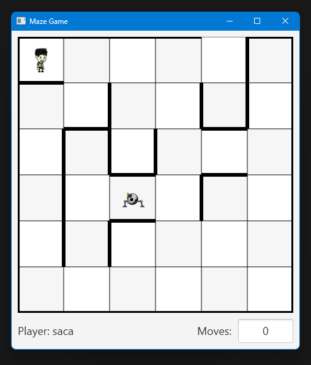

# Maze Game

In this project, I've created a maze game using JavaFX. Players navigate a maze grid to reach the exit while avoiding a chasing monster.

## Task

**(EN)**
In the diagram, a maze is depicted, in which we place a figure marked
with a light circle and a monster marked with a dark circle.
Our task is to guide the figure out of the maze through the exit
without being caught by the monster. The figure can move vertically
and horizontally one square, and it cannot cross the thick lines marked
as walls on the diagram. Each step of the figure triggers the movement
of the monster. The monster always attempts to move two squares to get
closer to the figure, prioritizing horizontal movements during its
motion. In summary, it moves according to the following algorithm:

If it can move one square left or right while getting closer to the figure, then it should move in that direction.

- If it can still move one square left or right while getting closer to the figure, then it should move in that direction.
- Otherwise, if it can still move one square up or down while getting closer to the figure, then it should move in that direction.
    
Otherwise, if it can move one square up or down while getting closer to the figure, then it should move in that direction.

- If it can still move one square left or right while getting closer to the figure, then it should move in that direction.
- Otherwise, if it can still move one square up or down while getting closer to the figure, then it should move in that direction.

**(HU)**
Az ábrán egy labirintus látható, melybe egy világos koronggal
jelzett figurát és egy sötét koronggal jelzett szörnyet helyezünk.
Feladatunk a figura kijuttatása a labirintusból a kijáraton át úgy,
hogy közben a szörny nem kapja el. A figura függőlegesen és
vízszintesen mozoghat egy mezőt, és nem léphet át az ábrán vastag
vonallal jelzett falakon. A figura minden egyes lépése maga után vonja
a szörny elmozdulását. A szörny minden esetben két mezőt próbál lépni
úgy, hogy közelebb kerüljön a figurához, mozgása során pedig előnyben
részesíti a vízszintes irányú elmozdulást. Összefoglalva, az alábbi
algoritmus szerint mozog:

Ha balra vagy jobbra mozoghat egy mezőt, miközben közelebb kerül a figurához, akkor lépjen az adott irányba. 

- Ha még egyet léphet balra vagy jobbra, miközben közelebb kerül a figurához, akkor lépjen az adott irányba.
- Egyébként ha még egyet léphet felfelé vagy lefelé, miközben közelebb kerül a figurához, akkor lépjen az adott irányba.

Egyébként ha felfelé vagy lefelé mozoghat egy mezőt, miközben közelebb kerül a figurához, akkor lépjen az adott irányba. 

- Ha még egyet léphet balra vagy jobbra, miközben közelebb kerül a figurához, akkor lépjen az adott irányba.
- Egyébként ha még egyet léphet felfelé vagy lefelé, miközben közelebb kerül a figurához, akkor lépjen az adott irányba.

## Solution

1. RIGHT
2. RIGHT
3. RIGHT
4. RIGHT

## How to Play

- Start the game by running the `mazegame.game.Main` class.
- Enter your name and start the game.
- Use the arrow keys or the mouse to move the player.
- Avoid the monster.
- Reach the exit to win.

## Features

- Monster moving algorithm to chase the player.
- Leaderboard to track the best times.

## Components

The game consists of the following components:

- [Components description](assets/UML/UML.md)
