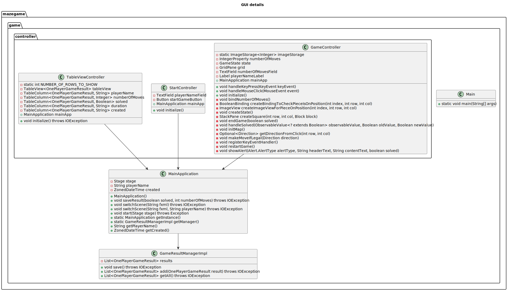

# Maze Game Components Overview

This document provides an overview of the components and their relationships in the Maze Game application.

## Map Details

The map package contains classes related to the maze structure and its components.

- **Maps**: Manages the collection of maps in the game.
- **MapData**: Represents individual maps with their properties like id, name, size, and blocks.
- **Block**: Represents a single block in the map grid with properties like walls, start/end points, and monsters.

## Model Details

The model package contains classes representing the game state and its elements.

- **GameState**: Manages the state of the game including player and monster positions, map details, and game logic.
- **Direction**: Enum representing the possible movement directions.
- **Position**: Represents the position of game entities in the maze.

## GUI Details

The game package contains classes related to the GUI and game management.

- **GameResultManagerImpl**: Manages game results including saving and retrieving them.
- **Main**: Entry point for the application.
- **MainApplication**: Manages the main application flow, scene switching, and game state.
- **TableViewController**: Controls the leaderboard table view and initializes it with game results.
- **StartController**: Controls the start screen UI and handles player input for starting the game.
- **GameController**: Controls the main game UI and logic, including player movement and game state updates.

## Relationships

- The **MainApplication** interacts with the **GameResultManagerImpl** to manage game results.
- **TableViewController**, **StartController**, and **GameController** depend on the **MainApplication** to manage the game state and scene switching.
- The **GameState** interacts with **Maps**, **Position**, and **Direction** classes to manage the game logic and entity positions.

[]